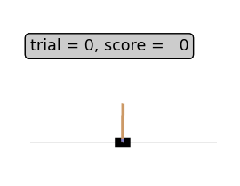

# XCSF learning classifier system

An implementation of the XCSF [learning classifier system](https://en.wikipedia.org/wiki/Learning_classifier_system) that can be built as a stand-alone binary or as a Python library. XCSF is an accuracy-based [online](https://en.wikipedia.org/wiki/Online_machine_learning) [evolutionary](https://en.wikipedia.org/wiki/Evolutionary_computation) [machine learning](https://en.wikipedia.org/wiki/Machine_learning) system with locally approximating functions that compute classifier payoff prediction directly from the input state. It can be seen as a generalisation of XCS where the prediction is a scalar value. XCSF attempts to find solutions that are accurate and maximally general over the global input space, similar to most machine learning techniques. However, it maintains the additional power to adaptively subdivide the input space into simpler local approximations.

*******************************************************************************

[](http://www.gnu.org/licenses/gpl-3.0)
[](https://github.com/rpreen/xcsf/actions?query=workflow%3A%22Ubuntu+build%22)
[](https://github.com/rpreen/xcsf/actions?query=workflow%3A%22macOS+build%22)
[](https://ci.appveyor.com/project/rpreen/xcsf)
[](https://github.com/rpreen/xcsf/releases)
[](https://zenodo.org/badge/latestdoi/28035841)

[](https://www.codacy.com/app/rpreen/xcsf)
[](https://lgtm.com/projects/g/rpreen/xcsf/context:cpp)
[](https://www.codefactor.io/repository/github/rpreen/xcsf)
[](https://www.code-inspector.com/public/project/2064/xcsf/dashboard)
[](https://sonarcloud.io/dashboard?id=rpreen_xcsf)
[](https://sonarcloud.io/dashboard?id=rpreen_xcsf)

*******************************************************************************

## Table of Contents

* [Overview](#overview)
* [Features](#features)
* [Requirements](#requirements)
* [Building](#building)
* [Running](#running)
* [Contributing](#contributing)
* [License](#license)

*******************************************************************************

## Overview

XCSF is [rule-based](https://en.wikipedia.org/wiki/Rule-based_machine_learning) and maintains a population of classifiers where each classifier *cl* consists of:

- a condition component *cl.C* that determines whether the rule matches input ***x***
- an action component *cl.A* that selects an action *a* to be performed for a given ***x***
- a prediction component *cl.P* that computes the expected payoff for performing *a* upon receipt of ***x***

XCSF thus generates rules of the general form:

IF *matches &larr; cl.C(****x****)* THEN perform action *a &larr; cl.A(****x****)* and EXPECT payoff ***p*** *&larr; cl.P(****x****)*.

For each step within a learning trial, XCSF constructs a match set [M] composed of classifiers in the population set [P] whose *cl.C* matches ***x***. If [M] contains fewer than *&theta;*<sub>mna</sub> actions, a covering mechanism generates classifiers with matching *cl.C* and random *cl.A*.

For each possible action *a<sub>k</sub>* in [M], XCSF estimates the expected payoff by computing the fitness-weighted average prediction *P*(*a<sub>k</sub>*). That is, for each action *a<sub>k</sub>* and classifier prediction *p<sub>j</sub>* in [M], the system prediction *P<sub>k</sub> = &sum;<sub>j</sub> F<sub>j</sub>p<sub>j</sub> / &sum;<sub>j</sub>F<sub>j</sub>*.

A system action is then randomly or probabilistically selected during exploration, and the highest payoff action *P<sub>k</sub>* used during exploitation. Classifiers in [M] advocating the chosen action are subsequently used to construct an action set [A]. The action is then performed and a scalar reward *r* &isin; &real; received, along with the next sensory input.

Upon reaching a terminal state within the environment (as is always the case in single-step problems), each classifier *cl<sub>j</sub>* &isin; [A] has its experience incremented and fitness, error, and set size *as* updated using the Widrow-Hoff [delta rule](https://en.wikipedia.org/wiki/Delta_rule) with learning rate *&beta;* &isin; [0,1] as follows.

- Error: *&epsilon;<sub>j</sub> &larr; &epsilon;<sub>j</sub> + &beta;* (| *r* &minus; *p<sub>j</sub>* | &minus; *&epsilon;<sub>j</sub>*)
- Accuracy: *&kappa;<sub>j</sub>* =
    * 1 if *&epsilon;<sub>j</sub> < &epsilon;<sub>0</sub>*
    * *&alpha;* ( *&epsilon;<sub>j</sub> / &epsilon;<sub>0</sub>* )<sup>&minus;*&nu;*</sup> otherwise.
<br>With target error threshold *&epsilon;<sub>0</sub>* and accuracy offset *&alpha;* &isin; [0,1], and slope *&nu;*.
- Relative accuracy: *&kappa;<sub>j</sub>'* = (*&kappa;<sub>j</sub> &middot; num<sub>j</sub>*) / *&sum;<sub>j</sub> &kappa;<sub>j</sub> &middot; num<sub>j</sub>*
<br>Where classifiers are initialised with numerosity *num* = 1.
- Fitness: *F<sub>j</sub> &larr; F<sub>j</sub> + &beta;*(*&kappa;<sub>j</sub>' &minus; F<sub>j</sub>*)
- Set size estimate: *as<sub>j</sub> &larr; as<sub>j</sub> + &beta;*(|[A]| &minus; *as<sub>j</sub>*)

Thereafter, *cl.C*, *cl.A*, and *cl.P* are updated according to the representation adopted.

The [evolutionary algorithm](https://en.wikipedia.org/wiki/Evolutionary_algorithm) (EA) is applied to classifiers within [A] if the average time since its previous execution exceeds *&theta;*<sub>EA</sub>. Upon invocation, the time stamp *ts* of each classifier is updated. Two parents are chosen based on their fitness via [roulette wheel selection](https://en.wikipedia.org/wiki/Fitness_proportionate_selection) (or [tournament](https://en.wikipedia.org/wiki/Tournament_selection)) and *&lambda;* number of offspring are created via [crossover](https://en.wikipedia.org/wiki/Crossover_(genetic_algorithm)) with probability *&chi;* and [mutation](https://en.wikipedia.org/wiki/Mutation_(genetic_algorithm)) with probability *&mu;*.

Offspring parameters are initialised by setting the error and fitness to the parental average, and discounted by reduction parameters for error *&epsilon;<sub>R</sub>* and fitness *F<sub>R</sub>*. Offspring *exp* and *num* are set to one. If subsumption is enabled and the offspring are subsumed by either parent with sufficient accuracy (*&epsilon;<sub>j</sub>* &lt; *&epsilon;<sub>0</sub>*) and experience (*exp<sub>j</sub> &gt; &theta;*<sub>sub</sub>) it is not included in [P]; instead the parents' *num* is incremented.

The resulting offspring are added to [P] and the maximum (micro-classifier) population size *N* is enforced by removing classifiers selected via roulette with the deletion vote.

The deletion vote is set proportionally to the set size estimate *as*. However, the vote is increased by a factor *F̅ / F<sub>j</sub>* for classifiers that are sufficiently experienced (*exp<sub>j</sub> &gt; &theta;*<sub>del</sub>) and with small fitness (*F<sub>j</sub> &lt; &delta;F̅*) where *F̅* is the [P] mean fitness, and typically *&delta;* = 0.1. Classifiers selected for deletion have their (micro-classifier) *num* decremented, and in the event that *num* < 1, are removed from [P].

In multi-step problems, the previous action set [A]<sub>-1</sub> is updated after each step using a *&gamma;* &isin; [0,1] discounted reward (similar to [*Q*-learning](https://en.wikipedia.org/wiki/Q-learning)) and the EA may be run therein.


A schematic illustration of XCSF is shown above. For supervised learning, a single (dummy) action can be used such that [A] = [M] and the system prediction made directly accessible to the environment.
                                                                                                 
A number of interacting pressures have been identified. A set pressure provides more frequent reproduction opportunities for more general rules. In opposition is a fitness pressure which represses the reproduction of inaccurate and over-general rules. Many forms of *cl.C*, *cl.A*, and *cl.P* have been used for classifier knowledge representation since the original ternary conditions, integer actions, and scalar predictions. Some of these are implemented here.

*******************************************************************************

## Features

Implements both [supervised learning](https://en.wikipedia.org/wiki/Supervised_learning) via the updating of match set errors directly and [reinforcement learning](https://en.wikipedia.org/wiki/Reinforcement_learning) via the updating of action set predictions with an environment reward. All mutation rates self-adapted. See `default.ini` for a list of options.

### Python Library

See [Wiki](https://github.com/rpreen/xcsf/wiki/Python-Library-Usage) for Python library usage.

### Conditions

* Always matching dummy conditions
* Hyperrectangles
* Hyperellipsoids
* Neural networks
* GP trees
* Dynamical GP graphs
* Ternary bitstrings (binarises inputs)
* Both conditions and actions in single dynamical GP graphs
* Both conditions and actions in single neural networks

### Actions

* Integers
* Neural networks

### Predictions

* Piece-wise constant
* Linear least squares
* Quadratic least squares
* Linear recursive least squares
* Quadratic recursive least squares
* Stochastic gradient descent neural networks

*******************************************************************************

## Requirements

Stand-alone binary:
 
* [C11](https://en.wikipedia.org/wiki/C11_(C_standard_revision)) compliant compiler.
* [CMake](https://www.cmake.org "CMake") (>= 3.12)
* [OpenMP](https://www.openmp.org "OpenMP") (optional): supported by [GCC](https://gcc.gnu.org "GCC") and [Clang](https://clang.llvm.org "clang") with libomp.

Python library:
 
* All of the above for building the stand-alone executable.
* C++11 compliant compiler.
* [Python](https://www.python.org "Python") (>= 3)

*******************************************************************************

## Building

### Compiler Options

* `XCSF_PYLIB = ON` : Python library (CMake default = OFF)
* `PARALLEL = ON` : CPU parallelised matching, predicting, and updating with OpenMP (CMake default = ON)
* `ENABLE_TESTS = ON` : Build and execute unit tests (CMake default = OFF)
  
### Ubuntu

18.04 / 20.04

```
$ sudo apt install python3 python3-dev cmake
$ git clone --recurse-submodules https://github.com/rpreen/xcsf.git
$ cd xcsf/build
$ cmake -DCMAKE_BUILD_TYPE=Release -DXCSF_PYLIB=ON -DENABLE_TESTS=ON ..
$ make
```

### OSX

XCode 10.1 + Clang

```
$ brew install libomp cmake python
$ git clone --recurse-submodules https://github.com/rpreen/xcsf.git
$ cd xcsf/build
$ cmake -DCMAKE_BUILD_TYPE=Release -DXCSF_PYLIB=ON -DENABLE_TESTS=ON ..
$ make
```

### Windows

[MinGW64-gcc-8.1.0](http://mingw-w64.org) + [Python 3.6.6 x86-64](https://python.org/downloads/windows/)

Notes: use 64-bit versions for both python and mingw. Tested with: python-3.6.6-amd64.exe and mingw-w64-install.exe (8.1.0; x86_64; posix; seh; 0). Some versions of python have difficulties compiling. XCSF build should generate only a single warning regarding a redundant redeclaration of 'double round(double)'. This is an issue with python and mingw having their own rounding functions, but this can safely be ignored. A simple method to get started is: Start -> MinGW-W64 project -> Run terminal -> change to the desired install location and enter the commands below. [Compilation should also be possible within an IDE such as Visual Studio or Eclipse.]

```
$ git clone --recurse-submodules https://github.com/rpreen/xcsf.git
$ cd xcsf\build
$ cmake -DCMAKE_BUILD_TYPE=Release -DXCSF_PYLIB=ON -DENABLE_TESTS=ON -G "MinGW Makefiles" ..
$ cmake --build . --config Release
```

### Documentation

[Doxygen](http://www.doxygen.nl/download.html) + [graphviz](https://www.graphviz.org/download/)

After running CMake:

```
$ make doc
```

Alternatively see: [XCSF documentation](https://rpreen.github.io/xcsf/).

*******************************************************************************

## Running

### Stand-alone

There are currently 3 built-in problem environments: {csv, mp, maze}.

Example real-multiplexer classification:

```
$ ./xcsf/main mp 6
```

Example discrete mazes:

```
$ ./xcsf/main maze ../env/maze/maze4.txt
```

Example regression: learning `env/csv/sine_3var_train.csv` and testing `env/csv/sine_3var_test.csv`

```
$ ./xcsf/main csv ../env/csv/sine_3var
```

### Python

After building with CMake option: `-DXCSF_PYLIB=ON`


Single-step reinforcement learning example:

```
$ python example_rmux.py
```

Multi-step reinforcement learning example:

```
$ python example_maze.py
```

[OpenAI Gym](https://gym.openai.com) (reinforcement learning) example:

```
$ python example_cartpole.py
```

Supervised regression learning example:

```
$ python example_regression.py
```

Supervised classification learning example:

```
$ python example_classification.py
```

*******************************************************************************

Example runs (from `example_maze.py`) through Maze4 after 2000 learning trials:


Example runs (from `example_cartpole.py`) on the OpenAI Gym cart-pole problem:



*******************************************************************************

## Contributing

Contributions are always welcome. See `CONTRIBUTING.md` for details.

*******************************************************************************

## License

This project is released under the GNU Public License v3. See `LICENSE.md` for details.
